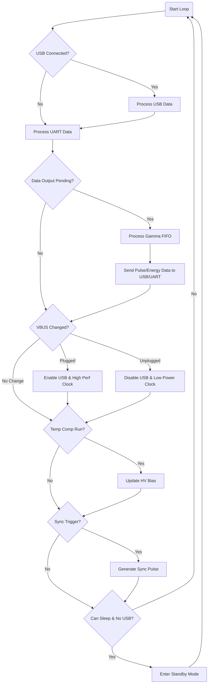

# PomeloCore Firmware Software Flow Summary

### **1. Initialization Flow**
The system starts by configuring hardware and restoring state.

*   **System & Power**: Initialize system clocks, voltage regulators, and NVM (Flash) settings.
*   **GPIO Configuration**: Set up pins for LED, USB VBUS, Analog Front End (AFE), Peak Detector, Ramp Generator, and Triggers.
*   **Peripherals Setup**:
    *   **RTC & Timers**: For timekeeping and gamma pulse timing.
    *   **EIC**: External Interrupts for triggers.
    *   **ADC & DAC**: For sampling signals and controlling High Voltage (HV).
    *   **I2C**: For external sensors (Temperature).
    *   **UART & USB**: For communication.
*   **State Restoration**: Load parameters from NVM (Flash) and apply them (HV settings, coincidence mode, etc.).

### **2. Main Loop Flow**
The infinite loop continuously handles communication, data processing, and power management.

### **3. Command Processing Flow**
Incoming characters from USB or UART trigger the `command_data_handler`.

*   **`g`**: Get CPM (Counts Per Minute).
*   **`u`**: Get uSv/h (Dose rate).
*   **`m`**: Measure (Returns JSON with CPM, uSv/h, Temperature).
*   **`i`**: Get SiPM current and diagnostics.
*   **`r`**: Reload parameters from Flash.
*   **`p`**: Enter Parameter Input Mode (Accepts configuration string).
*   **`/`**: Enable HV Boost.
*   **`*`**: Disable HV Boost.

### **4. Key Interrupt/Background Tasks**
*   **Trigger Callback**: Detects radiation pulses, captures peak energy, and stores in `gammaFifo`.
*   **Timer/RTC Callbacks**: Manage measurement windows and periodic tasks.
*   **HV Load Callback**: Monitors the current draw of the High Voltage supply.
